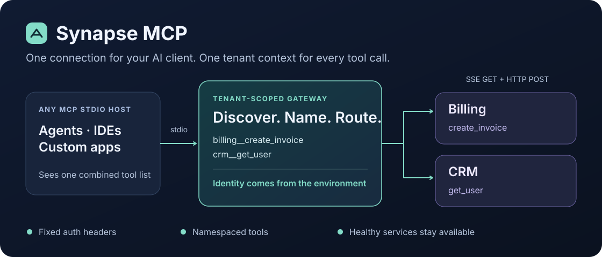
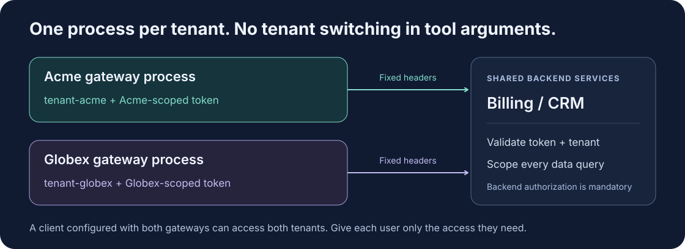

# Synapse MCP

**One connection to your tools. A fixed tenant context for every call.**

A **client-agnostic MCP gateway** for agents, IDEs, and custom applications. Connect any host with an MCP stdio integration to multiple internal MCP services. Synapse combines their tools, routes each call to the right service, and adds your service token and tenant ID to every downstream request.

Claude, Cursor, Hermes, OpenClaw, pi, or your own agent—the integration point is **MCP**, not a particular product. Each host needs compatible MCP support, either built in or through an adapter; see [client compatibility](#client-compatibility).



[](https://github.com/RohiRIK/synapse-mcp/actions/workflows/ci.yml)

[Get started](#get-started) · [Connect your AI client](#connect-your-ai-client) · [Optional dashboard](#optional-dashboard) · [Smoke tests](docs/testing.md) · [Technical reference](docs/reference.md)

## What does it do?

Imagine you have a billing server and a CRM server. Instead of configuring both in every AI client, connect the client to Synapse:

| Your service exposes | Your AI client sees |
| --- | --- |
| Billing → `create_invoice` | `billing__create_invoice` |
| CRM → `get_user` | `crm__get_user` |

The model chooses a tool. **It does not choose the tenant.** That identity comes from the gateway's environment, not tool arguments.

- **One tool list:** discover tools from all configured services in parallel.
- **No name collisions between services:** every tool gets a service prefix.
- **Partial-failure support:** if billing is offline, CRM can still work.
- **Bun-first development:** install, build, and test with Bun; run the MCP process with Node.

> [!NOTE]
> This is a **tools-only, stdio-to-SSE template** built with the official [MCP TypeScript SDK](https://github.com/modelcontextprotocol/typescript-sdk). It does not proxy resources or prompts. The SDK recommends Streamable HTTP for new services; this project currently connects to SSE endpoints. `/mcp` and `/sse` are not interchangeable.

### Available now vs. planned

| Available now | Planned—not implemented yet |
| --- | --- |
| Any compatible MCP **stdio** host → gateway | Optional client-facing Streamable HTTP endpoint |
| Gateway → downstream **SSE** services | Downstream Streamable HTTP alongside SSE |
| Optional read-only local dashboard | Reconnect, disconnect, and operator cancellation controls |

The dashboard's HTTP server is for the browser UI only. It is **not** an MCP endpoint. See the [implementation plan](docs/plans/lightweight-gateway.md) for the next steps.

## Get started

You'll need **Bun 1.3.14+**, **Node.js 22.14+**, and at least one downstream MCP server with an SSE endpoint. The example billing and CRM services are not included.

### Platform support

| Platform | Gateway (dashboard disabled) | Optional local dashboard |
| --- | --- | --- |
| macOS | Tested in CI on Node 22/24 | Supported |
| Linux | Tested in CI on Node 22/24 | Supported |
| Windows | Tested in CI on Node 22/24 | **Not supported natively**—keep `MCP_DASHBOARD_ENABLED=false` |

See the **[Windows / Linux / macOS setup guide](docs/platforms.md)** for host configuration examples and OS-specific notes. Check the current [CI results](https://github.com/RohiRIK/synapse-mcp/actions/workflows/ci.yml) before rolling out a revision. Windows uses stdin EOF for tested graceful cleanup; its forced process termination is not equivalent to POSIX signals. Named AI-host integrations and your own backend authorization still need a local acceptance check.

For a team handoff, start with a **small pilot**, not an unattended production rollout. Every user needs Node, Bun, a compatible MCP stdio host/integration, and authorized credentials for configured **SSE** backends. Downstream Streamable HTTP servers are not supported yet.

### 1. Install

```sh
git clone https://github.com/RohiRIK/synapse-mcp.git
cd synapse-mcp
bun install --frozen-lockfile
cp .env.example .env
```

On Windows PowerShell, use `Copy-Item .env.example .env` for the last step. The Bun commands are the same. Use `(Get-Command node).Source` to locate Node; in JSON, escape backslashes (`C:\\Path` becomes `"C:\\\\Path"`) or use forward slashes in absolute paths.

### 2. Set your identity

Edit `.env`:

```dotenv
SERVICE_AUTH_TOKEN=replace-with-your-service-token
TENANT_ID=tenant-acme
MCP_CONFIG_PATH=./config.json
```

Use the token itself, without a `Bearer ` prefix. Keep real credentials out of Git; `.env` is already ignored.

### 3. Add your services

Edit `config.json` to point at your actual SSE endpoints:

```json
{
  "services": [
    {
      "name": "billing",
      "url": "http://127.0.0.1:3001/sse",
      "timeout": 10000
    },
    {
      "name": "crm",
      "url": "http://127.0.0.1:3002/sse",
      "timeout": 10000
    }
  ]
}
```

`timeout` is in milliseconds. Use **HTTPS** outside loopback development addresses. Only configure trusted services: every listed endpoint receives the process's token and tenant ID.

### 4. Build

```sh
bun run build
```

You're ready to connect an AI client below. For a local startup check, you can also run:

```sh
node --env-file=.env dist/index.js
```

**A quiet terminal is normal.** This process waits for MCP messages on stdin; it isn't a chat interface or web server. Logs go to stderr. Press `Ctrl+C` to stop it.

## Connect your AI client

### Client compatibility

Synapse does not select, authenticate, or route differently based on the client brand. Today it exposes standard MCP over **stdio**:

| Your host supports | How to connect |
| --- | --- |
| Launching an MCP stdio server | Launch `node /absolute/path/to/synapse-mcp/dist/index.js` with the gateway environment variables |
| MCP through a plugin, extension, or bridge | Configure that integration to launch the same stdio command |
| Only remote HTTP MCP endpoints | An upstream Streamable HTTP server mode is still needed; it is not implemented yet |
| No MCP integration | Add an MCP client adapter first; Synapse cannot connect through a proprietary tool protocol automatically |

For Hermes, OpenClaw, pi, and other hosts, check the capabilities of your installed version and MCP integration. Their configuration formats can differ; do not assume they all accept the JSON below. Automated tests currently use the official SDK's MCP client—not a verified end-to-end integration with every named product.

In stdio mode, each host launches its own gateway process. This is not yet a shared network endpoint for multiple hosts. Upstream HTTP access is separate from the planned support for HTTP **downstream services**, and the optional dashboard is not an MCP endpoint.

### Example: Claude Desktop / Cursor

These are configuration examples, not a restriction on supported clients. Add this entry to Claude Desktop's `claude_desktop_config.json`, or to Cursor's MCP configuration. Replace the paths and credentials with your own:

```json
{
  "mcpServers": {
    "acme-gateway": {
      "command": "/absolute/path/to/node",
      "args": ["/absolute/path/to/synapse-mcp/dist/index.js"],
      "env": {
        "SERVICE_AUTH_TOKEN": "replace-with-acme-service-token",
        "TENANT_ID": "tenant-acme",
        "MCP_CONFIG_PATH": "/absolute/path/to/synapse-mcp/config.json"
      }
    }
  }
}
```

Restart your client after saving. When the downstream services are available, you should see tools such as `billing__create_invoice` and `crm__get_user`—the exact list comes from your servers.

**Two easy-to-miss details:**

- Use absolute paths. Desktop clients may not start in your project directory. On macOS/Linux, `command -v node` helps locate your Node executable.
- Launch Node directly, not `bun run start` or another package-manager wrapper. Keep script banners out of the MCP stdio channel. The host configuration above supplies the environment; it doesn't rely on your local `.env`.

## Multiple tenants

**Run one gateway process per tenant.** Give each process its own `TENANT_ID` and appropriately scoped token. The processes can share the same nonsecret service configuration.



For example, add `acme-gateway` and `globex-gateway` entries to your host configuration, each with a different environment. See the [complete two-tenant example](docs/reference.md#two-tenant-client-configuration).

> [!IMPORTANT]
> A client configured with **both** gateways can access **both** tenants. Give each user only the gateway and credentials they should have. Separate processes keep transport identities separate; they do not restrict a host that already has access to both.

## Where the security boundary is

Synapse enforces the gateway side:

- Forces `Authorization` and `X-Tenant-ID` headers on SSE GETs and HTTP POSTs.
- Rejects `tenant_id` arguments, including nested fields and common spelling variants.
- Blocks redirects and cross-origin message endpoints to avoid forwarding credentials elsewhere.

**Your backend must enforce the data-access side.** Validate the bearer token, verify that it permits the requested tenant, and scope every data query to that tenant. A description saying `[Tenant: tenant-acme]` helps the model understand context; it is not authorization.

Legacy tools that require a `tenant_id` argument must be updated to read the transport context instead. Synapse will not fill that argument in for them.

Read the [full security contract](docs/reference.md#tenant-security-contract) before deploying.

## Optional dashboard

Want a visual overview? The **[React + Vite dashboard](dashboard/README.md)** lives in its own `dashboard/` folder and is **disabled by default**. The gateway does not install, build, or start it automatically.

It shows opted-in local gateway sessions, MCP connection status, active requests, and recent logs. This first version is read-only; it cannot invoke tools, disconnect services, or change tenant identity.

```sh
# One-time optional setup
cd dashboard
bun install --frozen-lockfile
bun run build
```

Add `MCP_DASHBOARD_ENABLED=true` to the environment of each gateway you want to inspect, then restart those gateways. In a **separate terminal**, run `bun run start` from `dashboard/` and open the private localhost link it prints.

To disable it, stop the dashboard, set `MCP_DASHBOARD_ENABLED=false` (or remove it), and restart your gateways. You can leave `dashboard/` entirely uninstalled if you do not need it. Local telemetry currently supports macOS/Linux.

[Setup, screenshots, and privacy details →](dashboard/README.md)

## Everyday commands

| Command | What it does |
| --- | --- |
| `bun run dev` | Run the TypeScript entry point through `tsx` |
| `bun run build` | Compile TypeScript into `dist/` |
| `bun run start` | Run the compiled gateway with Node |
| `bun run test` | Build and run unit + real stdio/SSE integration tests |
| `bun audit --production` | Check production dependencies for known vulnerabilities |

Use **`bun run test`**, not `bun test`: the script uses Node's test runner to exercise the gateway's stdio runtime. Tests start their own local mock services; no external credentials are needed.

Bun scripts load `.env` automatically. Direct Node launches need `--env-file` or environment variables supplied by the host.

## Verify your setup

From the repository root, run `bun run check`. It builds the gateway and tests real MCP initialization, tool discovery/calls, tenant isolation, partial outages, and shutdown using an SDK client—not a specific AI product.

The optional dashboard has separate integration and browser checks. See **[smoke-test instructions](docs/testing.md)** for the complete commands and what they verify.

## Something not working?

| What you see | What to check |
| --- | --- |
| The terminal appears to do nothing | Normal: the gateway is waiting for an MCP client on stdin. |
| No tools appear | Check stderr, service URLs, credentials, and whether your downstream servers are running. If all are unavailable, the list is empty. |
| A restored service still isn't listed | Restart the gateway. Automatic session recovery is not implemented. |
| A tool call rejects `tenant_id` | Remove it from the arguments. Tenant identity belongs in the process environment. |
| A mutation timed out | Check the backend before retrying; the operation may already have executed. Use backend idempotency keys. |

## Want to change how it works?

The core is four files:

| File | Responsibility |
| --- | --- |
| [`src/config.ts`](src/config.ts) | Validate environment and service configuration |
| [`src/downstream.ts`](src/downstream.ts) | Connect, authenticate, discover tools, and enforce deadlines |
| [`src/gateway.ts`](src/gateway.ts) | Namespace tools, reject tenant overrides, and route calls |
| [`src/index.ts`](src/index.ts) | Run stdio and handle shutdown |

For configuration limits, protocol behavior, deployment notes, and the multi-tenant config example, see the **[technical reference](docs/reference.md)**.
