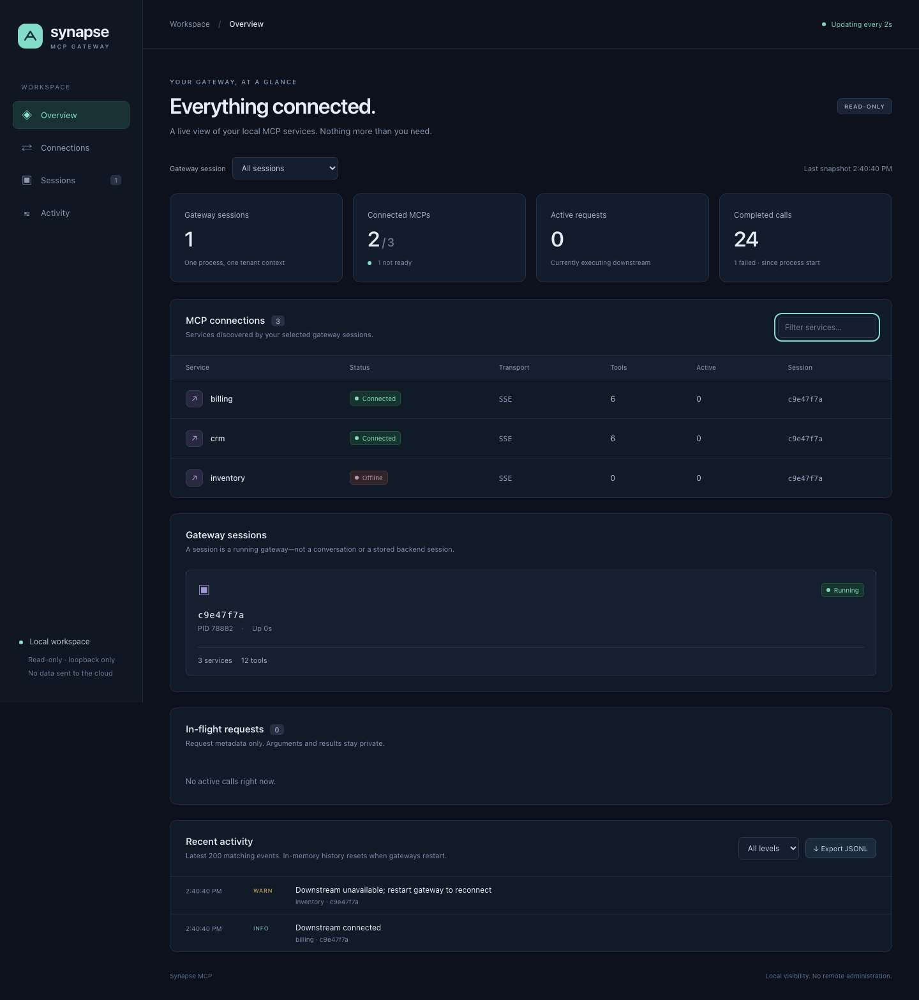

# Synapse dashboard — optional, local, read-only

A React + Vite dashboard for the client-agnostic Synapse MCP gateway. See your opted-in gateway processes, MCP connections, active requests, and recent events in one place—regardless of which compatible MCP host launched them.

**Disabled by default.** You can run the gateway without installing anything in this folder. No React/Vite dependencies are added to the gateway package, and no dashboard server starts with `bun run start` at the repository root.



*Screenshot uses isolated browser-test fixtures, not production data. The running dashboard never invents sessions or connections.*

## What is included?

- Session discovery across opted-in gateway processes running as your OS user.
- Connection state, current transport, tool counts, active-call counters, and process uptime.
- Active request IDs and timings—without arguments or results.
- Service-name filtering, a bounded recent-event view with level filtering, and JSONL download.
- Desktop and mobile layouts, empty/loading states, and a visible stale-data warning.

This first version is **read-only**. Reconnection, cancellation, remote administration, and tool invocation are not exposed. Dual downstream transports and broader session controls remain separate work in the [implementation plan](../docs/plans/lightweight-gateway.md); this dashboard does not change the current SSE transport.

## Enable it in three steps

Requires Bun 1.3.14+, Node 22.14+, and macOS or Linux for local Unix-socket telemetry. The gateway can still run on other supported platforms with the dashboard disabled.

### 1. Install and build the optional package

From the repository root:

```sh
bun install --frozen-lockfile
bun run build

cd dashboard
bun install --frozen-lockfile
bun run build
```

The dashboard has its own `package.json`, `bun.lock`, and build directory. The root package is intentionally **not** a workspace that automatically installs this package.

### 2. Opt in the gateways you want to see

For a local gateway, add this to the root `.env`:

```dotenv
MCP_DASHBOARD_ENABLED=true
```

Then start the gateway from the repository root:

```sh
node --env-file=.env dist/index.js
```

For any MCP host, pass `MCP_DASHBOARD_ENABLED=true` in the gateway process's environment and restart that process. This JSON is a **Claude Desktop/Cursor-style example**; Hermes, OpenClaw, pi, custom hosts, or their MCP adapters may use a different configuration format:

```json
{
  "mcpServers": {
    "acme-gateway": {
      "command": "/absolute/path/to/node",
      "args": ["/absolute/path/to/synapse-mcp/dist/index.js"],
      "env": {
        "SERVICE_AUTH_TOKEN": "replace-with-your-token",
        "TENANT_ID": "tenant-acme",
        "MCP_CONFIG_PATH": "/absolute/path/to/synapse-mcp/config.json",
        "MCP_DASHBOARD_ENABLED": "true"
      }
    }
  }
}
```

Each enabled gateway creates a private **read-only Unix socket**, not a TCP/HTTP listener. Its randomly generated gateway session ID identifies that process—not a conversation, credential, or backend protocol session. The browser dashboard is not an MCP endpoint and does not add HTTP support to the gateway's client-facing transport.

### 3. Start the dashboard when you want it

In a separate terminal:

```sh
cd /absolute/path/to/synapse-mcp/dashboard
bun run start
```

Open the private URL printed in that terminal. It uses `127.0.0.1` with an automatically selected port and a temporary access token in the URL fragment.

The page refreshes approximately every two seconds. It removes the token from the address bar immediately and retains it only in that browser tab's session storage. The fragment is not sent in HTTP requests. Restarting the dashboard generates a new token, so use the new printed link.

The dashboard does **not** need `SERVICE_AUTH_TOKEN` or `TENANT_ID`. Do not copy gateway credentials into the frontend, its environment, or `VITE_*` variables.

## Disable it

1. Stop the dashboard process with `Ctrl+C`. Gateways keep working.
2. Set `MCP_DASHBOARD_ENABLED=false`, or remove it, from gateway environments.
3. Restart those gateways to remove their telemetry agents.

You may then remove `dashboard/node_modules` and `dashboard/dist` if you no longer need them. Root builds/tests/start commands do not require either directory.

If explicitly enabled but not installed/built, the gateway fails startup with a safe diagnostic rather than silently claiming telemetry is enabled. Set the flag back to `false` to run without it. Only literal `true` and `false` are accepted.

## How it works

```text
Gateway A (opted in) ── private Unix socket ──┐
Gateway B (opted in) ── private Unix socket ──┤
                                            ▼
                                Local dashboard server
                                            │ authenticated loopback HTTP
                                            ▼
                                   React browser UI

Gateway C (disabled) ── no telemetry socket; not visible
```

All dashboard-specific code is in this directory. The gateway has only an opt-in dynamic-loader hook and an allowlisted inspection/log-observer interface. No gateway secrets, config objects, SDK clients, or raw exceptions are serialized into the dashboard.

### Privacy and access

- The dashboard HTTP server binds **only to `127.0.0.1`**. No configurable public bind address.
- API requests require a random per-launch bearer token. Incorrect Host/Origin headers and cross-site requests are rejected; there are no wildcard CORS permissions.
- The UI is served from built static files, not a Vite development server. It has a restrictive Content Security Policy and cannot be embedded in another page.
- A private per-user runtime directory has mode `0700`; telemetry sockets have mode `0600` and are checked for ownership/type/mode before use.
- Tokens, tenant IDs, full service URLs, backend session IDs, arguments, results, and raw downstream exceptions are excluded from telemetry. Service names and process IDs remain visible.
- This is a **same-user local interface**, not isolation from malicious software running as your OS user. Keep the startup link private. Use separate OS users for stronger separation.
- The dashboard sends no data to cloud services. Browser export downloads a local JSONL file.

The default runtime directory is `/tmp/synapse-dashboard-<uid>`. For tests or isolated local setups, set `SYNAPSE_DASHBOARD_RUNTIME_DIR` to the **same absolute private directory** in the gateway and dashboard environments. Keep its parent directories trusted and its path short enough for Unix sockets. Unsafe permissions and symlink directory targets are rejected.

### Limits and behavior

- Up to 32 telemetry socket candidates per poll; excess candidates produce a visible warning.
- Discovery uses batches of eight with 1.2-second per-socket deadlines and a 512 KiB snapshot limit. Malformed, unreachable, or stale peers are skipped.
- Recent logs retain at most 200 events per gateway in memory. The UI displays/exports the latest 200 events matching the selected session and level, newest first. No durable log history or automatic file rotation is provided here.
- Request details are capped at 128 per gateway; aggregate active counts include requests beyond that cap.
- Each agent accepts at most eight concurrent telemetry connections. HTTP snapshots are cached for one second and concurrent refreshes share one discovery operation.
- A gateway restart creates a new session ID and clears its event/request history. Graceful shutdown removes its socket. A crash can leave a stale socket; discovery skips it and reports it rather than deleting arbitrary endpoints.
- Export is a snapshot of the visible recent events, not a complete audit trail.
- Stopping or closing the browser does not affect gateway calls. Closing the browser tab does not stop the separate dashboard server; use `Ctrl+C` in its terminal.

## Development and checks

```sh
# Inside dashboard/, with the root gateway dependencies installed
bun run build
bun run test

# Optional browser tests; downloads Chromium for testing only
bunx playwright install chromium
bun run test:browser

bun audit --production
```

`bun run test` builds the root gateway and dashboard, then checks socket permissions, bounded logs, multiple instances, malformed peers, loopback authentication, real MCP telemetry, secret exclusion, and disabled-by-default behavior. Browser tests cover the launch link, empty state, filtering, export, mobile layout, session disappearance, and stale-data warnings.

For the full gateway-plus-dashboard verification sequence, see [smoke-test instructions](../docs/testing.md).

After editing frontend code, rebuild with `bun run build`, restart the dashboard server, and reload its private link. This package deliberately does not expose an unauthenticated Vite development server as a production dashboard.

```text
dashboard/
  src/           React interface and styles
  server/        Optional gateway agent, local discovery, loopback HTTP bridge
  shared/        Bounded telemetry schema and types
  test/          Node integration and security tests
  browser/       Playwright browser tests
  docs/          Screenshot assets
  dist/          Generated server + browser assets (ignored)
```
